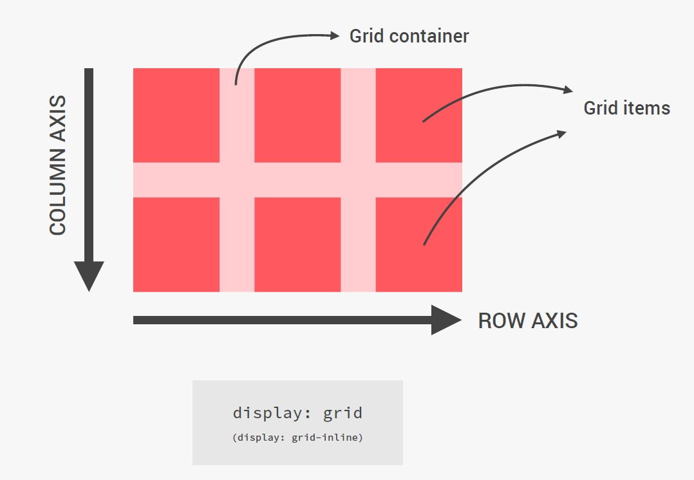

# Grid!



# Grid Terminology!


# Grid Overview!


### Basic setup

```
display: grid; <br>
grid-template-rows: 150px 150px;<br>
grid-template-columns: 150px 150px 150px;<br>
grid-row-gap: 30px;<br>
grid-column-gap: 30px;<br>
//grid-gap: 30px
```

### Repeat function

```
grid-template-rows: repeat(2, 150px);
```

### Repeat function with custom column size

```
grid-template-columns: repeat(2, 150px) 300px;
```
